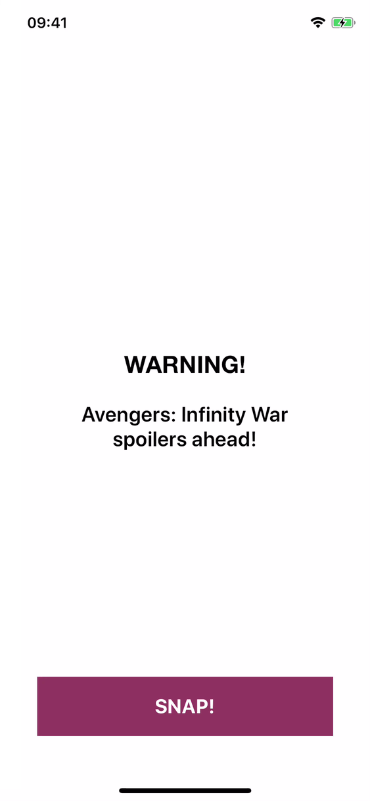

# DisintegrateUI

DisintegrateUI is a [Disintegrate](https://github.com/dbukowski/Disintegrate) but with SwiftUI api.

# Disintegrate

Disintegrate is a small library providing an animation inspired by how our favorite heroes disappeared at the end of Avengers: Infinity War.
The view or layer that you use it on is divided into small triangles, which then move into one direction and fade away. You can customize the estimated number of triangles and the direction they will move to.

<div align="center">
  <div>
  &nbsp;&nbsp;&nbsp;&nbsp;&nbsp;&nbsp;&nbsp;&nbsp;
  &nbsp;&nbsp;&nbsp;&nbsp;&nbsp;&nbsp;&nbsp;&nbsp;
  
  </div>
</div>
<br>

## Usage

DisintegrateUI adds a single method to a View.
```swift
func disintegrate(
        snap: Bool,
        direction: DisintegrationDirection = DisintegrationDirection.random(),
        estimatedTrianglesCount: Int = 66,
        completion: (() -> ())? = nil
    ) -> some View
```
The animation can be customized by two parameters:
* `direction` - direction in which the triangle particles will move. By default, the direction is chosen randomly from the set of 8 available options: up, down, left, right, upper left, upper right, lower left and lower right.
* `estimatedTrianglesCount` - estimated number of triangle particles. Specifying it allows you to adjust the performance of the animation to your needs. For example, if you know that you want to use it on a smaller view, you can divide it into more triangles. Keep in mind, that it is only an estimate, and the final count of the triangles will also depend on the exact size of the view or the layer. This parameter does have an empirically chosen default value, so you don't have to specify it.

Additionally, you can specify a completion block that will be executed when the animation finishes.

Here are some examples of using Disintegrate:
```swift
struct ContentView: View {
    @State var snap: Bool = false

    var body: some View {
      Image("spider-man")
          .resizable()
          .aspectRatio(contentMode: .fill)
          .frame(width: 120, height: 120)
          .clipped()
          .disintegrate(snap: snap)
          .onTapGesture {
              snap.toggle()
          }
    }
}
```

## Installation

### Swift Package Manager (SPM)

  1. From Xcode, select from the menu File > Swift Packages > Add Package Dependency
  2. Specify the URL `https://github.com/schornon/DisintegrateUI`

### Manually

Alternatively, you can simply copy files from `Sources` directory to your project.


## Requirements

Disintegrate requires iOS 16.0 or later.

## Author

### DisintigrateUI

SwiftUI api by Serhii Chornonoh, serjios19@gmail.com

### Disintigrate

Maintained by Maciej Mastalerz, maciej.mastalerz@gmail.com

Created by Dariusz Bukowski, dariusz.m.bukowski@gmail.com


## License

DisintegrateUI is available under the MIT license. See the LICENSE file for more info.
